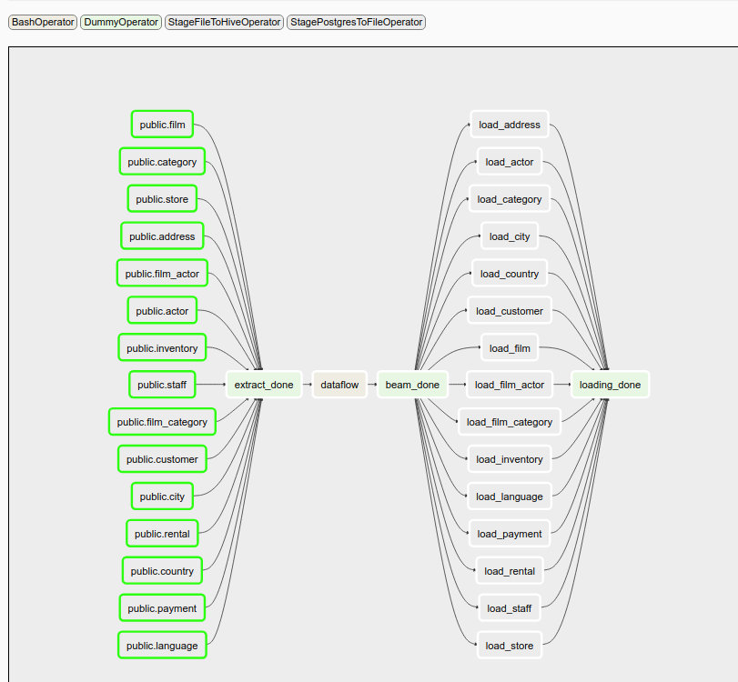
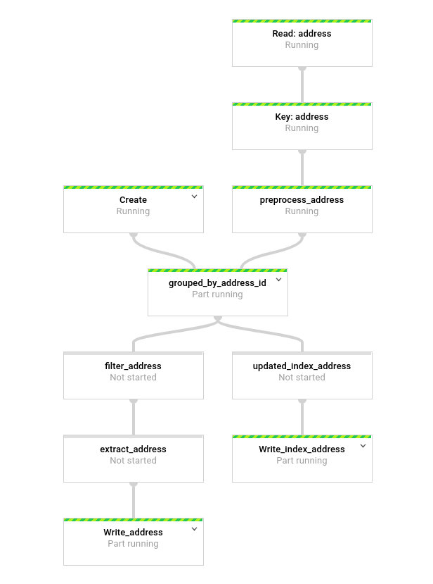

Data Vault with Big Data processes
==================================

.. important::

    This example is work in progress. It is now staging the data into the staging area of the DV,
    the load into the raw data vault is being worked on. I'm also in the process of validating this
    approach against the Data Vault 2.0 Modeling Standards and there are definitely deviations.

This example builds on the previous examples yet again and changes some of the pre-processing.
In conversations with others I extracted some important principles out of data warehousing
and integrated that with what modern technology offers us as reliability and technology.

The Datavault 2.0 book contains a picture that displays how you'd extract data from a source system,
hashes its business keys and then moves it into the data vault. The datavault 2 example was based 
on that, but never really explained very well in the book where the hashing should take place. 
In my example I chose to hash all the keys in the source system query, which I eventually think is wrong.

If you have:

- an **actor** made up of (actor_id, first_name, last_name), where (first_name, last_name) are the chosen business key
- a **film** made up of (film_id, title, release_year, ...), where (title, release_year) is the chosen business key
- a **film_actor** table made up of (film_id, actor_id), which associates actors with films

Then:

- **actor** would become a hub
- **film** would become a hub
- **film_actor** describes the relationship between films and actors, so it would become a link table

Actor and Film can easily be loaded in parallel, but there is ambiguity how the business keys for the
film_actor link table should be generated. A join is needed to both actor and film to get the desired
fields to generate the business key. If you have a full dump of a source system, then you can perform
the join in staging and you can also load the link table in parallel to the hubs. If you have an incremental
load, then you cannot guarantee the hub records are in staging, so you have to do a lookup of some kind.

The same is the case for some satellite tables, when they have a foreign key to a hub. An example could be a 
customerdetails table, which could be versioned and where the primary key points to a customerid in the customer
table, but the 'customer-tag' field is the real business key.

In my view this is the biggest lack of clarity of the data vault, because as soon as all the hubs,
links and satellites are in place, the downstream processes are completely clear and there's no ambiguity.

Thus, this example changes some of the design decisions made in previous examples:

- Joins in source OLTP system should not be used to resolve business keys
- For full replications of source data, the joins can be made in the data vault staging area instead
- For incremental loads, an index of primary key to hash key should be used to resolve the business key

This new example demonstrates how this would work and relies on a PSA as well. It is typically discouraged 
to use a PSA as a strategic mechanism for the data vault, but there are new trains of thought 
(because of BigData and data laking) where such opinions can change.

`Embrace your Persistent Staging Area <http://roelantvos.com/blog/?p=1890>` by Roelant Vos.

.. important::

    The implication of a PSA is that in theory, the data vault can be re-generated from scratch.
    How this impacts the data vault as a "System Of Record" and the associated auditability and traceability
    is unclear; perhaps from a legal perspective you won't be able to 'drop' the data vault like that.

The general process becomes:

- Dump your tables in full or incrementally `verbatim` into your data lake. Only worry about adding a "load_dtm" column in the source data, because that's always true. Dump them in a useful directory layout. I'm still looking if dividing by year with month, day and time in the filename is better (because it's easier to refer to them in a huge dataflow job and reprocess the data by year)
- Use Apache Beam (Google Cloud Dataflow, Apache Spark, etc) to generate three new columns: hash key of business key, source system and a status column to determine if a record is new, updated or deleted.
- Create tables in Data Vault using EXTERNAL TABLE with LOCATION set to cloud storage (zero bytes copied)
- Transfer records from these tables into the raw data vault. Because everything is generated, the queries are really simply.
- Do further data vault processing.

The idea is that the PSA is never touched ever again, it is how the source system was at some point.
What you gain from this strategy is that the choice of business key, hashing algorithm, length of hash and
other such design decisions can be modified later.

Principles
----------

This section lists some extracted principles that I think are extremely important to consider and they are valid if you build any kind of data warehouse. They are based on perceptions how some ODS's and Kimball systems evolved and how the specific procedures added complexity or rigidity into the system:

**Extract, verify and keep**: Extract source data and keep it historied in a PSA forever on practically infinite storage. Cloud storage provides eleven 9's of durability (1 in 10.000 documents is lost in 1 million years). This means that no other backup scheme can compete with this durability. Why not use that property?  (Just make sure that the extraction is 100% ok). Use UTF-8 as standard encoding, verify data types and precision output, etc. The extraction process is very generic, so once you have a generic process that really works, it is very easy to add more tables, which actually can become as simple as adding another line. (just work out the GDPR issues there :)

**Maintain data in lanes**: Do not combine data from multiple sources until the very last moment; delay this as far as possible. Think about processing data as having separate lanes of traffic in your data warehouse. The sooner data becomes integrated, the more processes downstream have to be modified when a source system changes, or become invalid for a longer period. Using views on terminal endpoints for each lane allows you to compare results individually and switch the implementation when the results are clear. The more you can keep data separated in lanes per source system, the less complex your data warehouse.

**Divide and conquer**: Don't perform all complicated logic in a single query; massage your data step by step, pivoting, filtering and working it until you can produce the end result with relatively simple joins. Add static data to define additional attributes where you may be missing some (never use mystical sequences of magic entity id's to filter data inside the query, i.e. don't hardcode id's). It's usually difficult to produce a useful analytical view  when you depart from the operational view, see the next principle!

**Work on abstraction layers**: Introduce abstraction layers to convert the OLTP design into an analytical structure. Data vault will not allow you to magically transform some OLTP design into a sensible business data model in a single step; the OLTP design always bleeds over into the raw data vault. The OLTP / 3NF design is optimized for operational purposes, so there are important transformations to make there and this requires some thinking.

About the implementation
------------------------

The example builds on the datavault2 example a lot, but some steps were introduced between the source system and the DV processing by sending data to the PSA and integrating the PSA strategically in the entire process.

What we gain there is a fully parallel process for taking source system data. The source system tables can be either 'incremental' or 'full'. As per the ETL principle, we are processing in pre-defined time intervals and our data is laid out in the PSA as such. 'Full' dumps make a dump of the entire table at the time the query is run.

Airflow shows that a lot of the steps can be run fully in parallel:

I rendered the following picture from the "DataFlow" UI on google cloud, the process is actually runnable on local disk as well using the beam API (acceptable for this data size). The way things are currently implemented is that the dataflow pipelines are running serially. It should be possible to establish correct dependencies between them in a single pipeline, so that it flows fully in parallel, but that is slightly more complicated.

- It reads from a table of interest, which produces records separated by a standard delimiter.
- Every row is then 'keyed' by applying the primary key, which generates a stream of data like (pk, record)
- The preprocessing stage generates the business key, source system column and a checksum.
- An 'index' is read from the left flow. If there is no index, it creates an empty pcollection. An index is a mapping of (pk, hash, checksum)
- Data is grouped by primary key and joined together. This gives us rows with an index and/or a data record (data may not yet be present in the index, maybe the specific pk is not in the data because there was no update or there is a match for an already existing record being updated)
- The index gets updated by adding all new data to the index and it gets overwritten.
- The address records get filtered. In the case of full dumps, the checksum for a large number of rows will be the same (record not updated). New, updated and optionally deleted rows are filtered in. Rows that did not change are filtered out, as determined by the row checksum.
- The addresses get extracted from the filtered stream and these need to be applied to the DV. Each row has a "NEW", "UPDATED" or "DELETED" marker.
- Not visible here is that hub tables with foreign keys do a lookup of the hash key of the foreign key by running the records through a 'CoGroupByKey' operation together with the foreign key index. This means that the processing needs to happen in the correct order, because the foreign key index must be complete to satisfy the lookup and this effectively establishes a processing order for hubs and links.

